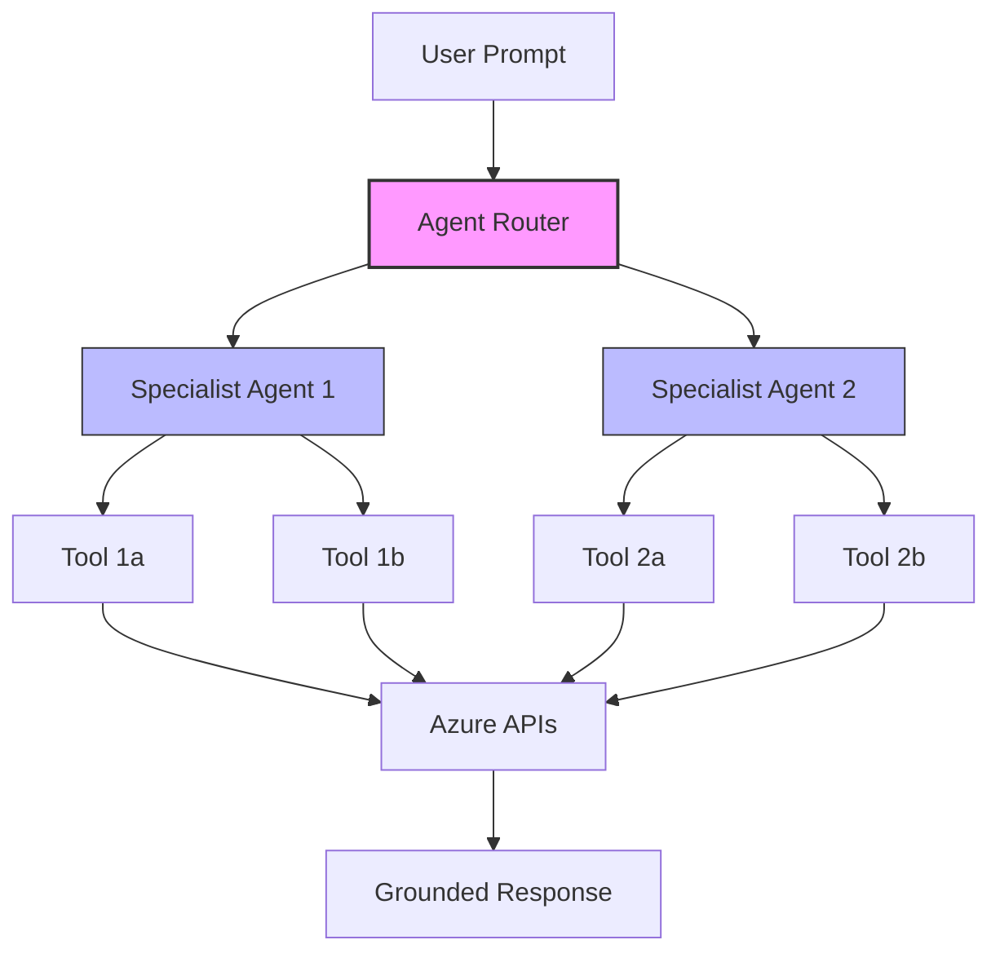

# 🧪 Agent Eval Skill

A **GitHub Copilot agent skill** for evaluating multi-agent AI systems on Azure AI Foundry. Clone this repo or add it as a custom skill to get instant access to evaluation patterns, SDK usage, troubleshooting, and Microsoft's observability best practices — right inside Copilot.

> Inspired by [bradygaster/squad](https://github.com/bradygaster/squad)'s skill-per-folder pattern.

---

## 🚀 Install as a Copilot Skill

### Option 1: Add to your repo (recommended)

Copy the `.copilot/skills/` directory into your project:

```bash
# Clone this repo
git clone https://github.com/gcb-mc/agent-eval-skill.git

# Copy the skills into your project
cp -r agent-eval-skill/.copilot/skills/ your-project/.copilot/skills/
```

Copilot CLI will auto-discover the skills when working in your repo.

### Option 2: Use directly

Clone and work inside this repo — all skills are available immediately:

```bash
git clone https://github.com/gcb-mc/agent-eval-skill.git
cd agent-eval-skill
pip install -r requirements.txt
```

---

## 📦 Skills Included

| Skill | Description |
|-------|-------------|
| **[multi-agent-eval](.copilot/skills/multi-agent-eval/SKILL.md)** | How to evaluate multi-agent AI systems — routing, tool selection, E2E pipelines, handoff detection |
| **[eval-sdk-patterns](.copilot/skills/eval-sdk-patterns/SKILL.md)** | Azure AI Evaluation SDK — 7 evaluators, batch `evaluate()`, two-phase approach, JSONL datasets |
| **[foundry-agent-patterns](.copilot/skills/foundry-agent-patterns/SKILL.md)** | How to call Foundry prompt agents — `responses.create` + `agent_reference` pattern |
| **[eval-troubleshooting](.copilot/skills/eval-troubleshooting/SKILL.md)** | Rate limits, content filters, column mapping gotchas, common SDK errors and fixes |
| **[agent-observability](.copilot/skills/agent-observability/SKILL.md)** | Microsoft's 5 best practices — monitoring, tracing, logging, evaluation, governance |

---

## 📓 Notebooks

Two complementary evaluation notebooks in `notebooks/`:

| Notebook | Purpose | Audience |
|----------|---------|----------|
| `multi_agent_evaluation.ipynb` | **Can it run?** — infra, RBAC, routing, tool connectivity, E2E | Platform/DevOps teams |
| `test_my_agents_v4.ipynb` | **How well does it answer?** — 7 evaluators, quality + agentic scoring | AI/ML teams, product owners |

### Quick Start

```bash
# 1. Install dependencies
pip install -r requirements.txt

# 2. Authenticate to Azure
az login

# 3. Configure environment
cp .env.template .env
# Edit .env with your Azure subscription ID, endpoints, etc.

# 4. Run the evaluation notebook
jupyter notebook notebooks/test_my_agents_v4.ipynb
```

---

## 🏗️ Architecture

### Evaluation Framework (10 Sections)



### Two-Phase Evaluation Pattern

```
Phase 1: Call agents → save responses to JSONL     (slow, rate-limited)
Phase 2: Run evaluate() on saved JSONL → scores    (fast, deterministic, retryable)
```

---

## 📋 Key Patterns

- **Declarative config** — define agents, tools, tests in a single `MULTI_AGENT_CONFIG` dict
- **AgentRouter** — uses OpenAI function-calling to route prompts to specialist agents
- **Two-phase evaluation** — separate data collection from scoring for reliability
- **Evaluator batching** — split 7 evaluators into 2 batches with 30s cooldown to avoid 429s
- **Retry logic** — exponential backoff on agent calls with `[ERROR]`/`[CONTENT_FILTERED]` markers

---

## 📚 Docs

| Document | Description |
|----------|-------------|
| [EVALUATION_GUIDE.md](docs/EVALUATION_GUIDE.md) | Detailed per-section explanation of the evaluation pipeline |
| [Walkthrough](docs/walkthrough_agent_evaluation_updates.md) | 20-minute talk-through of v1→v4 evolution and key patterns |
| [CSA Talking Points](docs/csa-talking-points.md) | Cloud Solution Architect guide for customer conversations |

---

## 🔧 Requirements

- Python 3.10+
- Azure CLI (`az login`)
- Azure subscription with AI Foundry project
- Foundry-hosted prompt agents
- Required RBAC roles assigned to agent managed identities

---

## 📄 License

MIT — see [LICENSE](LICENSE)
